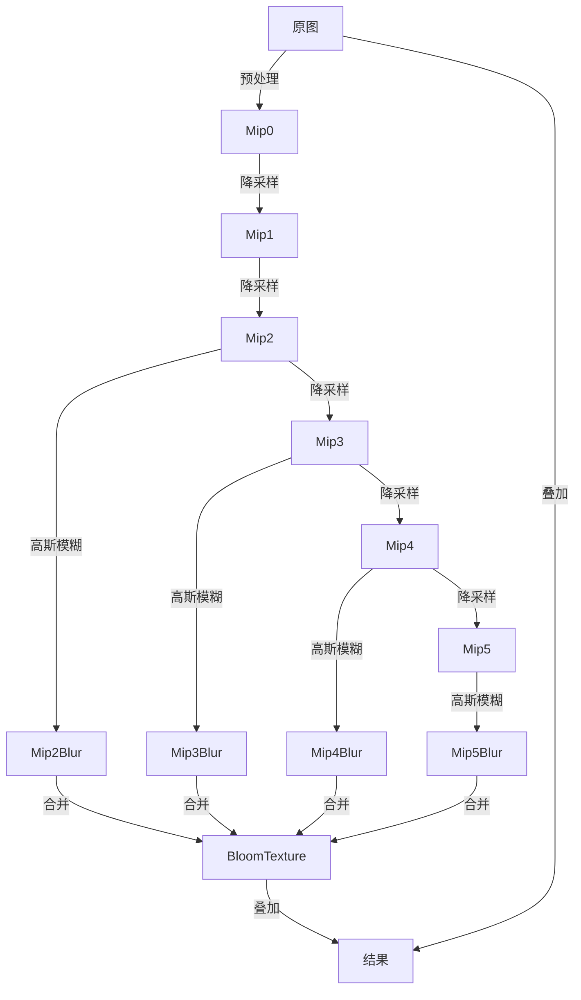
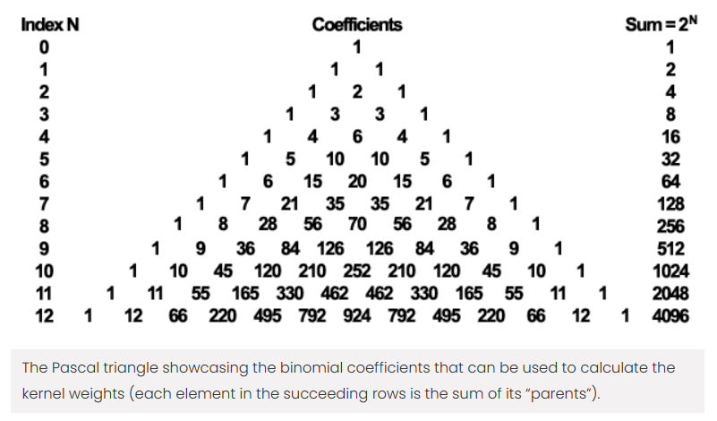
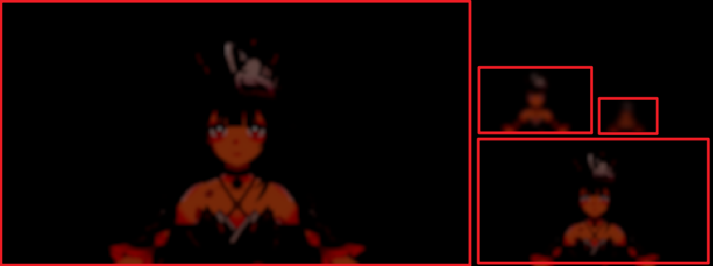
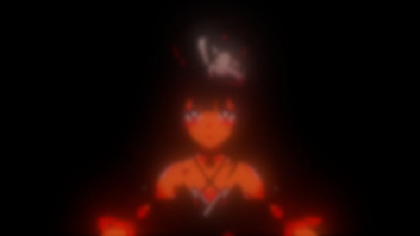

# 高质量卡通渲染 Bloom

我个人认为卡通渲染里 Bloom 还是挺重要的，它能对画面起到润色作用，比简单地后期调高饱和度要好看很多。


<!-- more -->

参考了几篇文章：

- [米哈游技术总监首次分享：移动端高品质卡通渲染的实现与优化方案 -腾讯游戏学堂](https://gwb.tencent.com/community/detail/124756)
- [高质量泛光（bloom）从理论到实战 - 知乎](https://zhuanlan.zhihu.com/p/525500877)
- [高质量泛光Bloom改进以及高斯核采样的优化 - 知乎](https://zhuanlan.zhihu.com/p/630726865)

## 什么是高质量 Bloom

借上面几篇知乎文章里说的：

1. 发光物边缘向外「扩张」得足够大。
2. 发光物中心足够亮（甚至超过 1.0 而被 clamp 成白色）。
3. 该亮的地方（灯芯、火把）要亮，不该亮的地方（白色墙壁、皮肤）不亮。

## 大致流程图



## 注意 HDR

参考 URP Bloom 的 `EncodeHDR` 和 `DecodeHDR`。Bloom 可能导致像素值超过 1，部分不支持 B10G11R11 RT 的设备要用 R8G8B8A8 RT 和 RGBM 编码。

## 预处理

预处理就是把图像中较亮的部分提取出来。卡通渲染里一般直接减去一个阈值即可。

``` hlsl
color = max(0, color - _BloomThreshold.rrr);
```

有需要的话，之后还可以给 `color` 乘上一个强度。

## 降采样

降采样是为了之后用较小的卷积核模糊更大的范围，就是 Mipmap 的思路。一般用 bilinear 每次长和宽都减少一半。

### 抗闪烁

常见的方法是 COD 用的 Karis Average：在第一次降采样时，给颜色乘上一个 `weight`，避免出现超级亮的像素。

``` hlsl
float luma = dot(color, float3(0.2126, 0.7152, 0.0722));
float weight = 1.0 / (1.0 + luma);
color *= weight;
```

这个会降低颜色的饱和度，对卡通渲染来说比较难受，所以我没用。

其实，闪烁主要的原因是有单独几个超亮像素一会出现一会消失。可以在降采样时，和周围的像素做加权平均，把亮度压下去。这样如果一个像素周围很亮，那么它还是很亮，产生稳定的泛光。如果一个像素周围都是暗的，它的亮度也会被压下去，闪烁就减少了。这个方法对颜色的饱和度没有很大影响，至少肉眼看不出来。

在 Vertex Shader 里，计算四个 uv 坐标。坐标都取在像素之间，后面 Fragment Shader 里用 bilinear 采样。

``` hlsl
float4 texelSize = _BlitTexture_TexelSize;
float4 offset1 = float4(-0.5, -0.5, -0.5, +0.5);
float4 offset2 = float4(+0.5, -0.5, +0.5, +0.5);
uv1 = texelSize.xyxy * offset1 + output.texcoord.xyxy;
uv2 = texelSize.xyxy * offset2 + output.texcoord.xyxy;
```

在 Fragment Shader 里，采样，然后计算平均值。

``` hlsl
half3 c1 = DecodeHDR(SAMPLE_TEXTURE2D_X(_BlitTexture, sampler_LinearClamp, uv1.xy));
half3 c2 = DecodeHDR(SAMPLE_TEXTURE2D_X(_BlitTexture, sampler_LinearClamp, uv1.zw));
half3 c3 = DecodeHDR(SAMPLE_TEXTURE2D_X(_BlitTexture, sampler_LinearClamp, uv2.xy));
half3 c4 = DecodeHDR(SAMPLE_TEXTURE2D_X(_BlitTexture, sampler_LinearClamp, uv2.zw));
return EncodeHDR(0.25 * (c1 + c2 + c3 + c4));
```

## 高斯模糊

设 $G(x,y)$ 是二维正态分布的概率密度函数，$f(x,y)$ 是坐标为 $(x,y)$ 处像素的值，$h(x,y)$ 是该处模糊后的值。做一个半径为 $r$ 的高斯模糊，即

$$
h(x,y)=\displaystyle\sum\limits_{i=-r}^{r}\displaystyle\sum\limits_{j=-r}^{r}f(x+i,y+j)G(i,j)
$$

假设图像的长和宽分别为 $m,n$，这个采样数是 $O(mnr^2)$，有点多。

### 减少采样数

对于 $G(x,y)$，$X$ 和 $Y$ 是相互独立的，相关系数 $\rho=0$。一般情况下，我们给中间的像素较大的权值（$\mu=0$），并且用对称的卷积核。所以

$$
G(x,y)=\frac{1}{2\pi \sigma^2} \exp \left (-\dfrac{x^2 + y^2}{2 \sigma^2} \right )
$$

能求出 $X$ 和 $Y$ 均服从 $N(0,\sigma^2)$，概率密度函数为

$$
G(x)=\frac{1}{\sqrt{2\pi} \sigma} \exp \left (-\dfrac{x^2}{2 \sigma^2} \right )
$$

且有

$$
G(x,y)=G(x)G(y)
$$

带入得

$$
h(x,y)=\displaystyle\sum\limits_{i=-r}^{r} \left (\displaystyle\sum\limits_{j=-r}^{r}f(x+i,y+j)G(j) \right ) G(i)
$$

所以，可以先做纵向模糊

$$
h_1(x,y)=\displaystyle\sum\limits_{j=-r}^{r} f(x,y+j) G(j)
$$

再做横向模糊

$$
h(x,y)=\displaystyle\sum\limits_{i=-r}^{r} h_1(x+i,y) G(i)
$$

这样采样数就变成了 $O(mnr)$，需要 2 个 pass。

### 快速计算卷积核

根据 [[../../../数学/概率论与数理统计/中心极限定理（Central limit theorem）#De Moivre-Laplace（棣莫弗 - 拉普拉斯）中心极限定理|De Moivre-Laplace CLT]]：若 $X \sim B(n,p)$，当 $n$ 充分大时，可以近似认为 $X \sim N(np, np(1-p))$。我们需要的是一个对称的卷积核，所以取 $p=\dfrac{1}{2}$。这个其实就是一些文章中提到用杨辉三角近似的原理。



对于第 $n$ 行的一组数，它们除以 $2^n$ 后近似服从 $N(\dfrac{n}{2},\dfrac{n}{4})$。

观察上面的图，每行最前面两个和最后面两个数都比较小，在计算时作用不大，可以去掉它们。[^1] 如果要一个长度为 $n$ 的卷积核，则选择第 $n+3$ 行的中间 $n$ 个数存进数组，有

$$
G[i]=\dfrac{1}{2^{n+3}-2(4+n)} \binom{n+3}{i+2}
$$

根据组合数的性质 [^2]

$$
\binom{n}{k+1}=\dfrac{n-k}{k+1}\binom{n}{k}
$$

可以求出递推公式

$$
G[i]=\dfrac{n-i+2}{i+2} G[i-1]
$$

它的初始值，我给出的是 $G[0]$ 前面一个值，不存进数组。

$$
G[-1]=\dfrac{n+3}{2^{n+3}-2(4+n)}
$$

不放代码了，一个 for 循环就行了。还能根据卷积核的对称性优化一下，只需要算一半的数字就行。

### Shader 代码

需要 C# 代码传入的值：

- `_BloomKernelSize`：卷积核的长度。
- `_BloomKernel`：卷积核数组。

Shader 里用一个 for 循环采样周围像素。

- 卷积核长度为偶数时，为了给中心的像素足够的权重，就都采样在两个像素之间了，`i - halfKernelSize` 为 $-1.5,-0.5,0.5,1.5$ 这样的值。
- 卷积核长度为奇数时，`i - halfKernelSize` 为 $-1,0,1$ 这样的值。

``` hlsl title="纵向模糊"
float texelSize = _BlitTexture_TexelSize.y;
float halfKernelSize = (_BloomKernelSize - 1) * 0.5;
float2 uv = UnityStereoTransformScreenSpaceTex(input.texcoord);

half3 color = 0;
for (int i = 0; i < _BloomKernelSize; i++)
{
    float2 offset = float2(0.0, texelSize * (i - halfKernelSize));
    half3 c = DecodeHDR(SAMPLE_TEXTURE2D_X(_BlitTexture, sampler_LinearClamp, uv + offset));
    color += c * _BloomKernel[i];
}
return EncodeHDR(color);
```

横向模糊类似。

要把多级 mip 都纵向横向模糊一遍。

### 卷积核长度选择

根据正态分布的 $3\sigma$ 法则，大致推测出高斯模糊的模糊范围和 $\sigma$ 正相关。因为长度为 $n$ 的卷积核取的是杨辉三角的第 $n+3$ 行，所以

$$
\sigma \approx \dfrac{\sqrt{n+3}}{2}
$$

因此，模糊的范围和卷积核的长度正相关。

mip 的分辨率越小，模糊的范围（卷积核的长度）就应该越大，否则可能出现很多方块图样。

### 处理多分辨率

同样的图案在不同分辨率下占有的像素数量不同。在卷积核大小不变的前提下，去模糊本文最上面花火的脸，低分辨率下能采样到脸外面的像素，但是高分辨率下就不一定能采样到了。所以多分辨率下模糊的结果可能不一致，最后泛光效果也不一样。具体来说，分辨率越高，向外泛出的光就越少。

我目前也没找到什么很好的解决方案，就强行把最后几个需要模糊的 mip 的分辨率都定死了。

一般游戏都是 16:9、16:10 这样的分辨率。取个比例差不多的较小的分辨率，比如 310x174，基本上没太大问题。要是屏幕比例差得太多，降采样时就会出现明显拉伸，Bloom 结果就会出现 artifact。

### 图集优化

因为要对多级 mip 做模糊，会出现很多 RT switch，对性能有影响。可以把纵向模糊的结果都绘制到一张图集上。用 [`CommandBuffer.SetViewport`](https://docs.unity3d.com/ScriptReference/Rendering.CommandBuffer.SetViewport.html) 来限制绘制的区域。



然后再做横向模糊，绘制到另一张图集上。

## 合并

需要 C# 代码传入的值：

- `_BloomUVMinMax`：图集中每张图的 uv 范围。xy 是 uv 最小值，zw 是 uv 最大值。

Shader 里直接把图集里所有图都采样一遍，然后叠加。

``` hlsl
float2 uv = UnityStereoTransformScreenSpaceTex(input.texcoord);

half3 color = 0;
UNITY_UNROLL for (int i = 0; i < MAX_MIP_DOWN_BLUR_COUNT; i++)
{
    float2 atlasUV = lerp(_BloomUVMinMax[i].xy, _BloomUVMinMax[i].zw, uv);
    color += DecodeHDR(SAMPLE_TEXTURE2D_X(_BlitTexture, sampler_LinearClamp, atlasUV));
}
return EncodeHDR(color);
```



之后把它拿给 UberPost，加到屏幕上即可。

### 防漏光

刚才叠加时是用 bilinear 采样的，在某张图边缘采样时可能采样到图集里的另一张图。解决方法是，在图和图之间加几个像素的 padding，一般 1 个像素就差不多了。

## 进一步阅读

- [复刻 绝区零/原神 的Bloom效果 - 知乎](https://zhuanlan.zhihu.com/p/675125241)：Bloom 图集的另一种实现。
- [Efficient Gaussian blur with linear sampling – RasterGrid](https://www.rastergrid.com/blog/2010/09/efficient-gaussian-blur-with-linear-sampling/)：讲了多种优化手段，除了杨辉三角，还有借助 bilinear 减少采样数的方法。

[^1]: [Efficient Gaussian blur with linear sampling – RasterGrid](https://www.rastergrid.com/blog/2010/09/efficient-gaussian-blur-with-linear-sampling/)
[^2]: [algorithm - How to efficiently calculate a row in pascal's triangle? - Stack Overflow](https://stackoverflow.com/questions/15580291/how-to-efficiently-calculate-a-row-in-pascals-triangle)
