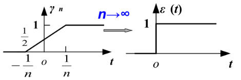
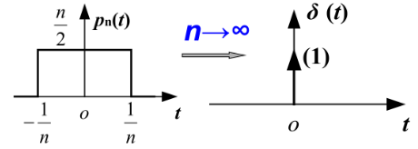

# 信号与系统

## 阶跃函数

用函数序列极限来定义

$$
\varepsilon(t) \stackrel{\text{def}}{=} \lim_{n \to \infty} \gamma_n(t) = \left\{\begin{matrix}
 0, &t<0 \\
 1, &t>0
\end{matrix}\right.
$$

它是一个奇异函数。

### 性质

$$
\int_{-\infty}^{t}\varepsilon(\tau)\mathrm{d}\tau=t\varepsilon(t)
$$

$$
\int_{-\infty}^{t}\varepsilon(\tau)\varphi(\tau)\mathrm{d}\tau=\varepsilon(t)\int_{0}^{t}\varphi(\tau)\mathrm{d}\tau
$$

### 广义函数

$$
\int_{-\infty}^{+\infty }\varepsilon(t)\varphi(t) \mathrm{d}t=\int_{0}^{+\infty }\varphi(t) \mathrm{d}t
$$

## 冲激函数

用函数序列极限来定义

$$
\delta(t) \stackrel{\text{def}}{=} \lim_{n \to \infty} p_n(t) = \left\{\begin{matrix}
 +\infty , &t=0 \\
 0, &t\neq0
\end{matrix}\right.
$$

它是一个奇异函数。

### 性质

- 积分面积（强度）为 1

    $$
    \int_{-\infty }^{+\infty }\delta(t)\mathrm{d}t=1
    $$

- 取样性质

    $$
    f(t)\delta(t)=f(0)\delta(t)
    $$

    $$
    f(t)\delta(t-a)=f(a)\delta(t-a)
    $$

- 冲激偶 $\delta'(t)$

    $$
    f(t)\delta'(t)=f(0)\delta'(t)-f'(0)\delta(t)
    $$

- 尺度变换

    $$
    \delta(at)=\frac{1}{\left|a\right|}\delta(t)
    $$

    $$
    \delta(at-t_0)=\frac{1}{\left|a\right|}\delta(t-\frac{t_0}{a})
    $$

    $$
    \delta^{(n)}(at)=\frac{1}{\left|a\right|} \cdot \frac{1}{a^n}\delta^{(n)}(t)
    $$

- 由尺度变换的推论

    $$
    \delta^{(n)}(-t)=(-1)^n\delta^{(n)}(t)
    $$

    可知 $\delta(t)$ 为偶函数，$\delta'(t)$ 为奇函数。

- 复合函数形式

    $$
    \delta[f(t)]=\sum_{i=1}^{n} \frac{1}{\left | f'(t_i) \right |} \delta(t-t_i)
    $$

    其中 $t_i(i=1,2,\cdots,n)$ 是 $f(t)=0$ 的 $n$ 个互不相等的实根。如果有重根，则 $\delta[f(t)]$ 无意义。

### 广义函数

$$
\int_{-\infty}^{+\infty }\delta(t)\varphi(t) \mathrm{d}t=\varphi(0)
$$

$$
\int_{-\infty}^{+\infty }\delta'(t)\varphi(t) \mathrm{d}t=-\varphi'(0)
$$

$$
\int_{-\infty}^{+\infty }\delta^{(n)}(t)\varphi(t) \mathrm{d}t=(-1)^n\varphi^{(n)}(0)
$$

## 阶跃函数与冲激函数的关系

$$
\delta(t)=\frac{\mathrm{d} \varepsilon(t)}{\mathrm{d} t}
$$

$$
\varepsilon(t)=\int_{-\infty}^{t}\delta(\tau)\mathrm{d}\tau
$$

## 单位阶跃序列

$$
\varepsilon(k) \stackrel{\text{def}}{=} \left\{\begin{matrix}
 0, &k<0 \\
 1, &k\ge0
\end{matrix}\right.
$$

## 单位样值序列

$$
\delta(k) \stackrel{\text{def}}{=} \left\{\begin{matrix}
 1, &k=0 \\
 0, &k\neq0
\end{matrix}\right.
$$

### 取样性质

$$
f(k)\delta(k)=f(0)\delta(k)
$$

$$
f(k)\delta(k-k_0)=f(k_0)\delta(k-k_0)
$$

$$
\sum_{k=-\infty}^{+\infty}f(k)\delta(k)=f(0)
$$

## 单位阶跃序列与单位样值序列的关系

$$
\delta(k)=\varepsilon(k)-\varepsilon(k-1)
$$

$$
\varepsilon(k)=\sum_{i=-\infty}^{k}\delta(i)
$$

$$
\varepsilon(k)=\sum_{i=0}^{+\infty}\delta(k-i)
$$
