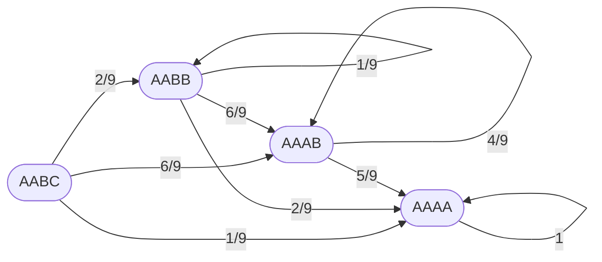

# 算一算青雀进暗杠的抽牌数期望

用[马尔可夫链（Markov chain）](https://en.wikipedia.org/wiki/Markov_chain)暴力计算。顺便复习一下线代。

<!-- more -->

## 起因

看到这两个视频以后，心血来潮算的。

    <iframe src="//player.bilibili.com/player.html?aid=1752122559&bvid=BV1vx421k77C&cid=1479621819&p=1&autoplay=0" scrolling="no" border="0" frameborder="no" framespacing="0" allowfullscreen="true"> </iframe>

    <iframe src="//player.bilibili.com/player.html?aid=996148265&bvid=BV16s4y1B7jm&cid=1129947597&p=1&autoplay=0" scrolling="no" border="0" frameborder="no" framespacing="0" allowfullscreen="true"> </iframe>

这下真看 V 看的了。

## 青雀的抽牌机制

> *天赋* 帝垣琼玉
>
> 我方目标回合开始时，青雀会从 3 种不同花色的琼玉牌中随机抽取 1 张，最多持有 4 张琼玉牌。青雀回合开始时，若持有的琼玉牌数为 4 且花色相同，青雀消耗所有琼玉牌进入【暗杠】状态。处于【暗杠】状态时无法再次施放战技，同时使自身攻击力提高，普攻【门前清】强化为【杠上开花！】，【暗杠】状态会在施放【杠上开花！】后结束。
>
> ---
>
> *战技* 海底捞月
>
> 立即抽取 2 张琼玉牌，使自身造成的伤害提高，持续至本回合结束。该效果可以叠加 4 次。施放该战技后，本回合不会结束。[^1]

牌堆里有 3 种花色，最多同时持有 4 张牌，4 个花色相同则进暗杠。可以忽略牌的具体花色，把牌型抽象成 AABC、AABB、AAAB、AAAA 四种，AAAA 表示进入暗杠。

> 青雀的摸牌是一个将琼玉牌从牌堆中取出并记录其内容，然后再将刚刚摸到的牌归还牌堆的过程，而非从牌堆中摸取琼玉牌并保留于手中的过程。根据青雀的摸牌规则（留多去少）我们又可以推导出：AAAA、AAAB、AABB、AABC是一个层级系统，后者可以向前者晋升，前者却不可向后者跌落。[^2]

假设青雀牌堆里，各花色的牌都有无穷多张。战技抽牌流程：先抽 2 张，再去掉手里 6 张中花色数量最少的 2 张。

## 马尔可夫链

为了避免图太乱，权为 $0$ 的边就不画了。可以列出下表

|下次牌型\当前牌型|AABC|AABB|AAAB|AAAA|
|:-:|:-:|:-:|:-:|:-:|
|AABC (n+1)|$0$|$0$|$0$|$0$|
|AABB (n+1)|$\dfrac{2}{9}$|$\dfrac{1}{9}$|$0$|$0$|
|AAAB (n+1)|$\dfrac{6}{9}$|$\dfrac{6}{9}$|$\dfrac{4}{9}$|$0$|
|AAAA (n+1)|$\dfrac{1}{9}$|$\dfrac{2}{9}$|$\dfrac{5}{9}$|$1$|

转移矩阵

$$
A = \begin{bmatrix}
0 & 0 & 0 & 0\\
\dfrac{2}{9} & \dfrac{1}{9} & 0 & 0\\
\dfrac{6}{9} & \dfrac{6}{9} & \dfrac{4}{9} & 0\\
\dfrac{1}{9} & \dfrac{2}{9} & \dfrac{5}{9} & 1
\end{bmatrix}
$$

记

- $a_n$ 为第 $n$ 次抽牌后，牌型为 AABC 的概率 
- $b_n$ 为第 $n$ 次抽牌后，牌型为 AABB 的概率 
- $c_n$ 为第 $n$ 次抽牌后，牌型为 AAAB 的概率 
- $d_n$ 为第 $n$ 次抽牌后，牌型为 AAAA 的概率 

可以得到公式

$$
\begin{bmatrix}
a_n\\
b_n\\
c_n\\
d_n
\end{bmatrix} = A^n \begin{bmatrix}
a_0\\
b_0\\
c_0\\
d_0
\end{bmatrix}
$$

## 不同牌型的抽牌数期望

先要把 $A$ 对角化。由

$$
\abs{\lambda E - A} = \begin{vmatrix}
\lambda & 0 & 0 & 0\\
-\dfrac{2}{9} & \lambda-\dfrac{1}{9} & 0 & 0\\
-\dfrac{6}{9} & -\dfrac{6}{9} & \lambda-\dfrac{4}{9} & 0\\
-\dfrac{1}{9} & -\dfrac{2}{9} & -\dfrac{5}{9} & \lambda-1
\end{vmatrix} = 0
$$

得

$$
\lambda \left ( \lambda-\frac{1}{9} \right ) \left ( \lambda-\frac{4}{9} \right ) \left ( \lambda-1 \right )=0
$$

可求得特征值和对应的特征向量为

- $\lambda_1=0$，$v_1=(2,-4,3,-1)^T$。
- $\lambda_2=\dfrac{1}{9}$，$v_2=(0,1,-2,1)^T$。
- $\lambda_3=\dfrac{4}{9}$，$v_3=(0,0,1,-1)^T$。
- $\lambda_4=1$，$v_4=(0,0,0,1)^T$。

记

$$
P=\begin{pmatrix}
v_1 & v_2 & v_3 & v_4
\end{pmatrix}
$$

因为

$$
\abs{P} = \begin{vmatrix}
2 & 0 & 0 & 0\\
-4 & 1 & 0 & 0\\
3 & -2 & 1 & 0\\
-1 & 1 & -1 & 1
\end{vmatrix} = 2
$$

不为 $0$，所以

$$
A=P \begin{bmatrix}
0 & 0 & 0 & 0\\
0 & \dfrac{1}{9} & 0 & 0\\
0 & 0 & \dfrac{4}{9} & 0\\
0 & 0 & 0 & 1
\end{bmatrix} P^{-1}
$$

故

$$
\begin{bmatrix}
a_n\\
b_n\\
c_n\\
d_n
\end{bmatrix} = P \begin{bmatrix}
0 & 0 & 0 & 0\\
0 & \left ( \dfrac{1}{9} \right )^n & 0 & 0\\
0 & 0 & \left ( \dfrac{4}{9} \right )^n & 0\\
0 & 0 & 0 & 1
\end{bmatrix} P^{-1} \begin{bmatrix}
a_0\\
b_0\\
c_0\\
d_0
\end{bmatrix}
$$

$P$ 的伴随矩阵

$$
P^*=\begin{bmatrix}
1 & 0 & 0 & 0\\
4 & 2 & 0 & 0\\
5 & 4 & 2 & 0\\
2 & 2 & 2 & 2
\end{bmatrix}
$$

$P$ 的逆矩阵

$$
P^{-1}=\dfrac{1}{\abs{P}}P^*=\begin{bmatrix}
\dfrac{1}{2} & 0 & 0  & 0\\
2 & 1 & 0 & 0\\
\dfrac{5}{2} & 2 & 1 & 0\\
1 & 1 & 1 & 1
\end{bmatrix}
$$

所以

$$
\begin{bmatrix}
a_n\\
b_n\\
c_n\\
d_n
\end{bmatrix} = \begin{bmatrix}
0 & 0 & 0 & 0\\
2\left(\dfrac{1}{9}\right)^n & \left(\dfrac{1}{9}\right)^n & 0 & 0\\
-4\left(\dfrac{1}{9}\right)^n+\dfrac{5}{2}\left(\dfrac{4}{9}\right)^n & -2\left(\dfrac{1}{9}\right)^n+2\left(\dfrac{4}{9}\right)^n & \left(\dfrac{4}{9}\right)^n & 0\\
2\left(\dfrac{1}{9}\right)^n-\dfrac{5}{2}\left(\dfrac{4}{9}\right)^n+1 & \left(\dfrac{1}{9}\right)^n-2\left(\dfrac{4}{9}\right)^n+1 & -\left(\dfrac{4}{9}\right)^n+1 & 1
\end{bmatrix} \begin{bmatrix}
a_0\\
b_0\\
c_0\\
d_0
\end{bmatrix}
$$

上式中 $n \ge 1$。抽牌数的期望

$$
EX=(d_1-d_0) + \sum_{n=2}^{\infty} n(d_n-d_{n-1})
$$

式中 $d_0$ 是参数，不可以用 $d_n$ 的通项计算，只能拿出来单独处理。展开后即

$$
EX=(d_1-d_0) + \sum_{n=2}^{\infty} n\left( \dfrac{5}{9}\left(\dfrac{5}{2}a_0+2b_0+c_0\right)\left(\dfrac{4}{9}\right)^{n-1} - \dfrac{8}{9}\left(2a_0+b_0\right)\left(\dfrac{1}{9}\right)^{n-1} \right)
$$

令

- $k_1=\dfrac{5}{9}\left(\dfrac{5}{2}a_0+2b_0+c_0\right)$
- $k_2=-\dfrac{8}{9}\left(2a_0+b_0\right)$
- $S(q)=\displaystyle\sum\limits_{n=2}^{\infty} \left( k_1n(4q)^{n-1} + k_2nq^{n-1} \right)$

则

$$
EX=(d_1-d_0) + S(\dfrac{1}{9})
$$

由

$$
S(q) = \left(\sum_{n=2}^{\infty} \left( \dfrac{1}{4}k_1(4q)^n + k_2q^n \right) \right)'
$$

得

$$
S(q)=\frac{8k_1q(1-2q)}{(1-4q)^2} + \frac{k_2q(2-q)}{(1-q)^2}
$$

进而解出

$$
EX = \begin{bmatrix}
\dfrac{11}{4} & \dfrac{99}{40} & \dfrac{9}{5} & 0
\end{bmatrix} \begin{bmatrix}
a_0\\
b_0\\
c_0\\
d_0
\end{bmatrix}
$$

|牌型|抽牌数期望|
|:-:|:-:|
|AABC|$\dfrac{11}{4}=2.75$|
|AABB|$\dfrac{99}{40}=2.475$|
|AAAB|$\dfrac{9}{5}=1.8$|
|AAAA|$0$|

## 抽牌数综合期望

起始牌型的概率分布

|起始牌型|AABC|AABB|AAAB|AAAA|
|:-:|:-:|:-:|:-:|:-:|
|$P$|$\dfrac{C_4^2 \cdot 3 \cdot 2}{3^4}=\dfrac{4}{9}$|$\dfrac{C_4^2 \cdot C_3^2}{3^4}=\dfrac{2}{9}$|$\dfrac{C_4^3 \cdot 3 \cdot 2}{3^4}=\dfrac{8}{27}$|$\dfrac{3}{3^4}=\dfrac{1}{27}$|

取

$$
(a_0, b_0, c_0, d_0)^T=(\dfrac{4}{9}, \dfrac{2}{9}, \dfrac{8}{27}, \dfrac{1}{27})^T
$$

算得

$$
EX = \dfrac{89}{36} \approx 2.3056
$$

## 牌型分布

|抽牌次数\牌型|AABC|AABB|AAAB|AAAA|
|:-:|:-:|:-:|:-:|:-:|
|0|${\color{Red} 44.44\%}$|$22.22\%$|$29.63\%$|$3.70\%$|
|1|$0.00\%$|$12.35\%$|${\color{Red} 57.61\%}$|$30.04\%$|
|2|$0.00\%$|$1.37\%$|$33.84\%$|${\color{Red} 64.79\%}$|
|3|$0.00\%$|$0.15\%$|$15.95\%$|${\color{Red} 83.89\%}$|
|4|$0.00\%$|$0.02\%$|$7.19\%$|${\color{Red} 92.79\%}$|
|5|$0.00\%$|$0.00\%$|$3.21\%$|${\color{Red} 96.79\%}$|
|6|$0.00\%$|$0.00\%$|$1.43\%$|${\color{Red} 98.57\%}$|
|7|$0.00\%$|$0.00\%$|$0.63\%$|${\color{Red} 99.37\%}$|

[^1]: [青雀-崩坏:星穹铁道WIKI-开拓者笔记-米游社](https://bbs.mihoyo.com/sr/wiki/content/497/detail?bbs_presentation_style=no_header)
[^2]: [短生种都能看懂的青雀摸牌概率【科学琼玉论】-崩坏：星穹铁道社区-米游社](https://www.miyoushe.com/sr/article/39578076)
