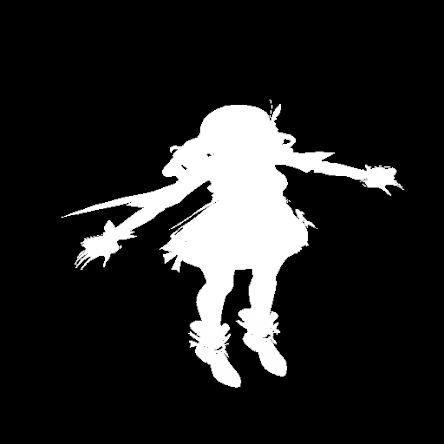

# 实现 Per-Object Shadow

有些物体在阴影空间中占比较小，用 Unity 默认的方案得到的阴影精度较低。Per-Object Shadow 就是给物体单独生成一张 ShadowMap，实现高精度的阴影。



<!-- more -->

上图是用 4 张 512x512 的 Per-ObjectShadowMap 拼成的图集。

参考文章：

- [图形引擎实战：自阴影渲染分享 - 知乎](https://zhuanlan.zhihu.com/p/667305414)

## 角色包围盒

要让角色尽可能撑满 ShadowMap，就需要知道角色的包围盒。思路：找到角色身上所有投射阴影的 `Renderer`，把它们的 [`Renderer.bounds`](https://docs.unity3d.com/ScriptReference/Renderer-bounds.html) 合并起来。

``` csharp
Bounds bounds = default;
bool firstBounds = true;

for (int i = 0; i < renderers.Count; i++)
{
    Renderer renderer = renderers[i];

    if (TryAppendShadowRenderers(renderer, shadowRendererList))
    {
        if (firstBounds)
        {
            bounds = renderer.bounds;
            firstBounds = false;
        }
        else
        {
            bounds.Encapsulate(renderer.bounds);
        }
    }
}
```

``` csharp
private static bool TryAppendShadowRenderers(Renderer renderer, List<ShadowRendererData> outShadowRenderers)
{
#if UNITY_EDITOR
    if (UnityEditor.SceneVisibilityManager.instance.IsHidden(renderer.gameObject))
    {
        return false;
    }
#endif

    if (!renderer.enabled || renderer.shadowCastingMode == ShadowCastingMode.Off)
    {
        return false;
    }

    if (!renderer.gameObject.activeInHierarchy)
    {
        return false;
    }

    try
    {
        bool hasShadowCaster = false;
        renderer.GetSharedMaterials(s_CachedMaterialList);

        for (int i = 0; i < s_CachedMaterialList.Count; i++)
        {
            Material material = s_CachedMaterialList[i];

            if (TryGetShadowCasterPass(material, out int passIndex))
            {
                hasShadowCaster = true;
                outShadowRenderers.Add(new ShadowRendererData(renderer, material, i, passIndex));
            }
        }

        return hasShadowCaster;
    }
    finally
    {
        s_CachedMaterialList.Clear();
    }
}

private static bool TryGetShadowCasterPass(Material material, out int passIndex)
{
    Shader shader = material.shader;

    for (int i = 0; i < shader.passCount; i++)
    {
        if (shader.FindPassTagValue(i, s_LightModeTagName) == s_ShadowCasterTagId)
        {
            passIndex = i;
            return true;
        }
    }

    passIndex = -1;
    return false;
}
```

## View Projection Matrix

这部分代码我是拿 Burst + JobSystem 写的。

## 绘制阴影

## Shadow Matrix

``` csharp
private Matrix4x4 GetShadowMatrix(Vector2Int tilePos, in ShadowCasterData casterData)
{
    Matrix4x4 proj = casterData.ProjectionMatrix;

    if (SystemInfo.usesReversedZBuffer)
    {
        proj.m20 = -proj.m20;
        proj.m21 = -proj.m21;
        proj.m22 = -proj.m22;
        proj.m23 = -proj.m23;
    }

    float oneOverTileCount = 1.0f / m_ShadowMapSizeInTile;

    Matrix4x4 textureScaleAndBias = Matrix4x4.identity;
    textureScaleAndBias.m00 = 0.5f * oneOverTileCount;
    textureScaleAndBias.m11 = 0.5f * oneOverTileCount;
    textureScaleAndBias.m22 = 0.5f;
    textureScaleAndBias.m03 = (0.5f + tilePos.x) * oneOverTileCount;
    textureScaleAndBias.m13 = (0.5f + tilePos.y) * oneOverTileCount;
    textureScaleAndBias.m23 = 0.5f;

    // Apply texture scale and offset to save a MAD in shader.
    return textureScaleAndBias * proj * casterData.ViewMatrix;
}
```
