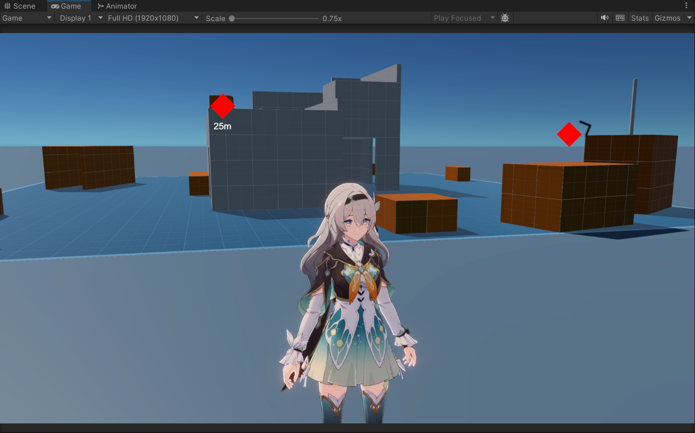
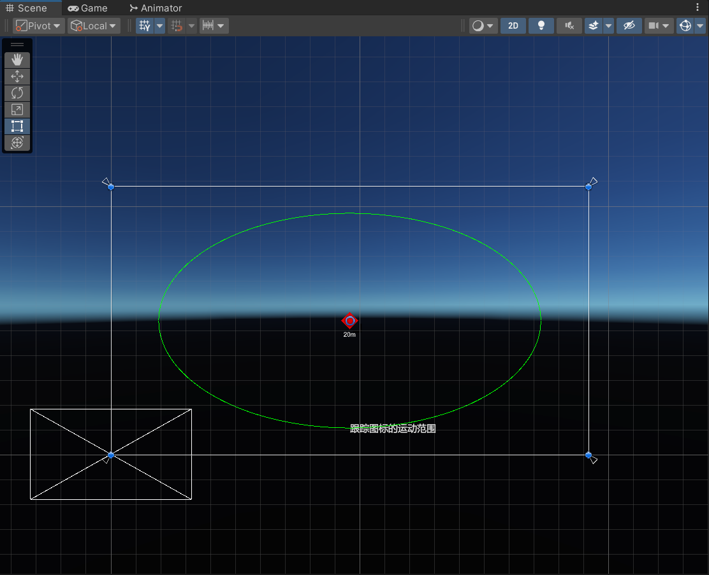

# 在 UI 上实现目标追踪

实现目标任务追踪功能。在 UI 上的椭圆区域内，显示目标的方向和距离。



<!-- more -->

## 配置椭圆

公开两个字段，用于配置椭圆两个轴的长度。取值范围设置为 $[0,1]$，方便配置。另外，规定水平的是长轴，竖直的是短轴。

``` csharp
[Range(0, 1)] public float HorizontalSize = 0.8f;
[Range(0, 1)] public float VerticalSize = 0.8f;
```

结合 Panel 的 `RectTransform.rect` 可以确定椭圆方程中的 $a$ 和 $b$。

``` csharp
private void GetEllipseParam(RectTransform panelRect, out float a, out float b)
{
    Rect rect = panelRect.rect;
    a = rect.width * 0.5f * HorizontalSize;
    b = rect.height * 0.5f * VerticalSize;
}
```

## 编辑器辅助线

在编辑器中绘制辅助线，帮助我们直观地看到椭圆范围。



Unity 没有提供绘制椭圆的方法。只能在椭圆上多采一些离散的点，然后用 [`Gizmos.DrawLineStrip(points, true)`](https://docs.unity3d.com/ScriptReference/Gizmos.DrawLineStrip.html){ target="_blank" } 绘制，第二个参数为 `true` 表示绘制为首尾闭合的多边形。

``` csharp
private void OnDrawGizmosSelected()
{
    RectTransform rect = transform as RectTransform;
    GetEllipseParam(rect, out float a, out float b);
    Vector3[] points = new Vector3[360];

    // 极坐标下，每隔一度采一个点
    for (int i = 0; i < 360; i++)
    {
        float x = a * Mathf.Cos(i * Mathf.Deg2Rad);
        float y = b * Mathf.Sin(i * Mathf.Deg2Rad);
        points[i] = rect.TransformPoint(x, y, 0);
    }

#if UNITY_EDITOR
    UnityEditor.Handles.Label(points[270], "跟踪图标的运动范围");
#endif

    var color = Gizmos.color;
    Gizmos.color = Color.green;
    Gizmos.DrawLineStrip(new ReadOnlySpan<Vector3>(points), true);
    Gizmos.color = color;
}
```

## 计算目标点在 UI 上的位置

先计算目标点的屏幕坐标，再转换成 Panel 的本地坐标即可。考虑两种特殊情况：

1. 目标点在屏幕后面。

    > 判断方法很多，用屏幕坐标的深度、相机空间坐标的 z 值都可以。

2. 目标点不在椭圆范围内。

    > 设目标点在 Panel 中的本地坐标为 $(x,y)$，如果 $\dfrac{x^2}{a^2}+\dfrac{y^2}{b^2}>1$ 就是在外面。

这时要把坐标限制在椭圆上。根据目标点在相机空间的坐标 `posVS.xy` 可以确定它在 Panel 本地坐标系中相对于原点的方向，进而确定一条从原点出发的射线。记 `posVS.xy` 为 $(u,v)$，该射线与椭圆的交点为：

$$
\frac{ab}{\sqrt{a^2v^2+b^2u^2}} (u,v)
$$

!!! tips

    - 使用这个公式时，没必要对 $(u,v)$ 归一化。
    - 不能用屏幕坐标代替 `posVS.xy`！！！屏幕坐标在超出屏幕范围后容易跳变，显示出来效果不够丝滑。

``` csharp
private Vector2 GetLocalPos(Transform target, RectTransform panelRect, Camera mainCamera, Camera uiCamera, out bool isOutsideView)
{
    GetEllipseParam(panelRect, out float a, out float b);
    Vector3 posVS = mainCamera.worldToCameraMatrix.MultiplyPoint3x4(target.position);
    Vector2 localPos;

    if (posVS.z >= 0)
    {
        isOutsideView = true;
        localPos = Vector2.zero;
    }
    else
    {
        Vector3 posNDC/* (1)! */ = mainCamera.projectionMatrix.MultiplyPoint(posVS);
        Vector2 posScreen = new Vector2((posNDC.x + 1) * 0.5f * Screen.width, (posNDC.y + 1) * 0.5f * Screen.height);
        RectTransformUtility.ScreenPointToLocalPointInRectangle(panelRect, posScreen, uiCamera, out localPos);
        isOutsideView = (localPos.x * localPos.x) / (a * a) + (localPos.y * localPos.y) / (b * b) > 1;
    }

    if (isOutsideView)
    {
        float s = a * b / Mathf.Sqrt(a * a * posVS.y * posVS.y + b * b * posVS.x * posVS.x);
        (localPos.x, localPos.y) = (posVS.x * s, posVS.y * s);
    }

    return localPos;
}
```

1. [`MultiplyPoint`](https://docs.unity3d.com/ScriptReference/Matrix4x4.MultiplyPoint.html){ target="_blank" } 相比 [`MultiplyPoint3x4`](https://docs.unity3d.com/ScriptReference/Matrix4x4.MultiplyPoint3x4.html){ target="_blank" } 多了透视除法，所以乘出来直接是 NDC 坐标。具体可以看 `MultiplyPoint` 的源码。

把结果赋值给 Panel 里一个图标的 `localPosition` 即可。箭头方向、距离之类的功能比较简单，不写了。
