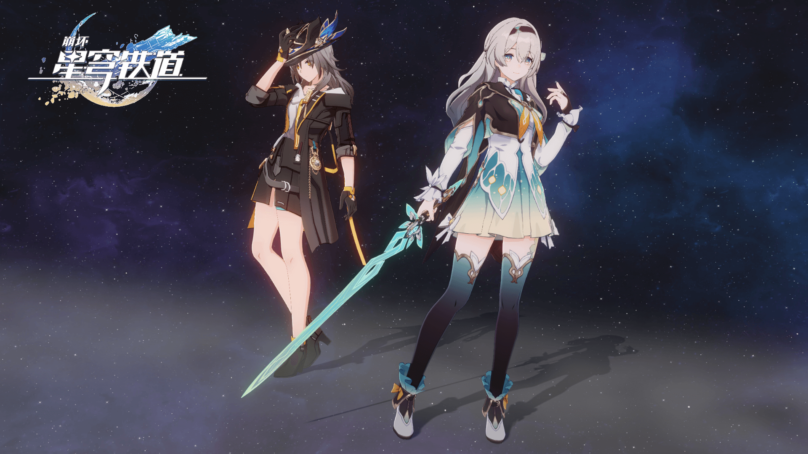

# About

Welcome to my Chinese notebook — currently with <!-- NUM NOTES --> notes!

## Intro

=== "English"

    - An undergraduate student at Xidian University, majoring in Computer Science and Technology, expected to graduate in 2026.
    - Currently exploring technologies related to game engine development.
    - Contact information is available on my [homepage](https://stalomeow.com){target="_blank"}.

=== "中文"

    - 西安电子科技大学本科生，计算机科学与技术专业，预计 2026 年毕业。
    - 正在学习游戏引擎相关技术。
    - 可在我的[主页](https://stalomeow.com){target="_blank"}查看联系方式。

## Recent Notes

=== "English"

=== "中文"

<!-- RECENT NOTES -->

## Projects

=== "English"

    - [March Engine](https://github.com/stalomeow/MarchEngine){target="_blank"}: A game engine based on Direct3D 12, C++17, and .NET 9 for learning purposes.

        {.fancybox-thumbnail}

    - [Dream Ticker](https://github.com/stalomeow/DreamTicker){target="_blank"}: A replica of Dream Ticker, an optical illusion-based puzzle game from Honkai: Star Rail 2.0.

        

    - [StarRail NPR Shader](https://github.com/stalomeow/StarRailNPRShader){target="_blank"}: Fan-made shaders for Unity URP attempting to replicate the shading of Honkai: Star Rail.

        {.fancybox-thumbnail}

    - [Quick Play Mode](https://github.com/stalomeow/QuickPlayMode){target="_blank"}: Reduce the wait time caused by Unity Domain Reloading and enter Play Mode faster.
    - [Resume Template](https://github.com/stalomeow/resume-template){target="_blank"}: A résumé template written in Typst.
    - [Traintime PDA](https://github.com/BenderBlog/traintime_pda){target="_blank"}: An open-source personal data assistant for XDU students, with several features contributed by me.
    - You can find more projects on my [GitHub](https://github.com/stalomeow){target="_blank"}.

=== "中文"

    - [March Engine](https://github.com/stalomeow/MarchEngine){target="_blank"}：基于 Direct3D 12、C++17 和 .NET 9 的游戏引擎，用于学习目的。

        {.fancybox-thumbnail}

    - [Dream Ticker](https://github.com/stalomeow/DreamTicker){target="_blank"}：复刻崩坏：星穹铁道 2.0 的视错觉游戏「梦境迷钟」。

        

    - [StarRail NPR Shader](https://github.com/stalomeow/StarRailNPRShader){target="_blank"}：基于 Unity URP 的仿星穹铁道渲染 Shader。

        {.fancybox-thumbnail}

    - [Quick Play Mode](https://github.com/stalomeow/QuickPlayMode){target="_blank"}：减少 Unity Domain Reloading 导致的等待时间，快速进入播放模式。
    - [Resume Template](https://github.com/stalomeow/resume-template){target="_blank"}：使用 Typst 编写的简历模板。
    - [Traintime PDA](https://github.com/BenderBlog/traintime_pda){target="_blank"}：为西电学生设计的开源信息查询软件。我贡献了一些功能。
    - 可以访问我的 [GitHub](https://github.com/stalomeow){target="_blank"} 查看更多项目。
