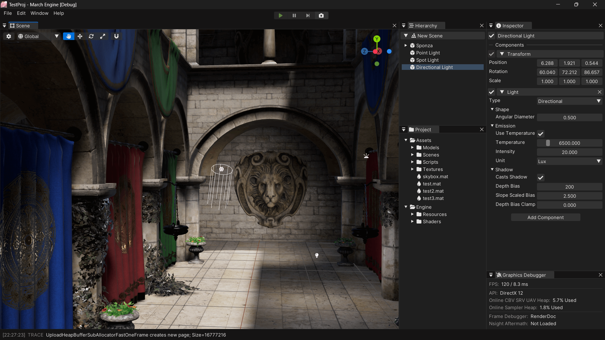

# About

Welcome to my Chinese notebook — currently with <!-- NUM NOTES --> notes! <small>Only this page is in English, used for self-introduction.</small>

{.fancybox-thumbnail}

## Intro

- CS Undergrad at Xidian University, 2026
- Game Engine Dev Intern at miHoYo
- Contact: [mail@stalomeow.com](mailto:mail@stalomeow.com){target="_blank"}

## Recent Notes

<!-- RECENT NOTES -->

## Personal Projects

- <small>2024</small> [March Engine](https://github.com/stalomeow/MarchEngine){target="_blank"}：A game engine based on Direct3D 12, C++17, and .NET 9 for learning purposes.

    {.fancybox-thumbnail}

- <small>2024</small> [Dream Ticker](https://github.com/stalomeow/DreamTicker){target="_blank"}：A replica of Dream Ticker, an optical illusion-based puzzle game from Honkai: Star Rail 2.0.

    

- <small>2023</small> [StarRail NPR Shader](https://github.com/stalomeow/StarRailNPRShader){target="_blank"}：Fan-made shaders for Unity URP attempting to replicate the shading of Honkai: Star Rail.

    {.fancybox-thumbnail}

- <small>2023</small> [Quick Play Mode](https://github.com/stalomeow/QuickPlayMode){target="_blank"}：Reduce the wait time caused by Unity Domain Reloading and enter Play Mode faster.

- You can find more projects on my [GitHub](https://github.com/stalomeow){target="_blank"}.
