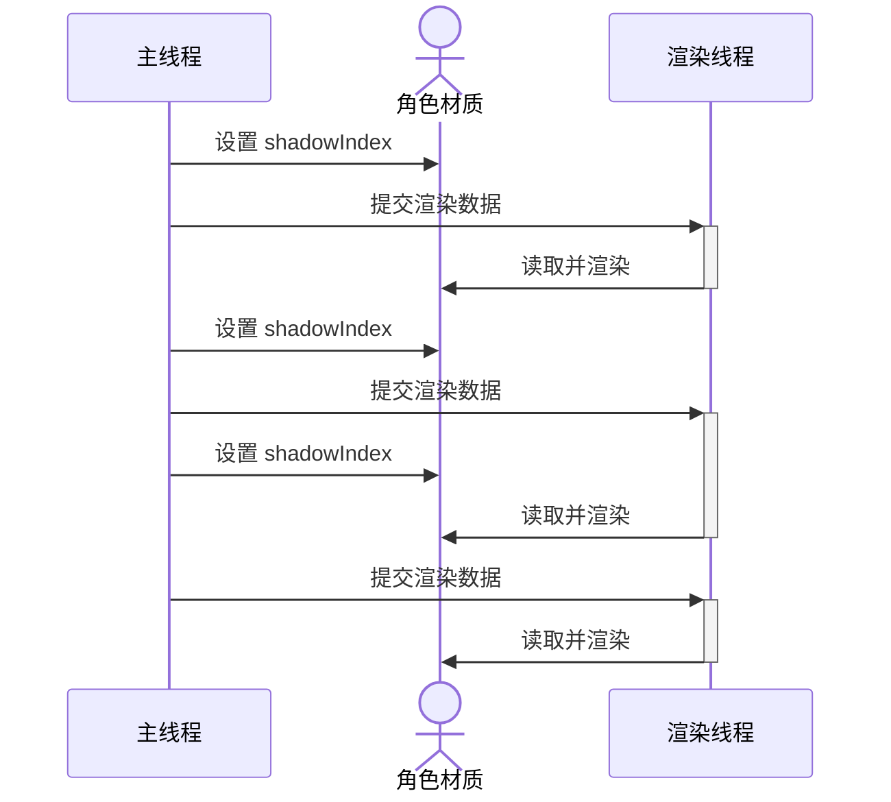

# 仿星铁渲染：主光源角色阴影

<!-- more -->

角色阴影使用了逐物体阴影技术。因为代码有点多，所以只挑一些关键的写。

## 逐物体阴影

逐物体阴影（Per-Object Shadow）就是给物体单独生成一张 Shadow Map，解决物体在默认的 Cascaded Shadow Map 上占比较小，阴影精度低的问题，顺便还能把场景阴影和角色阴影分开。

![[per-object-shadow-map.png|Per-Object Shadow Map，角色尽可能撑满整张图]]

代码大体上按照 URP 的 [`MainLightShadowCasterPass`](https://github.com/Unity-Technologies/Graphics/blob/master/Packages/com.unity.render-pipelines.universal/Runtime/Passes/MainLightShadowCasterPass.cs) 写，但是一些矩阵需要自己计算。

### 角色包围盒

要让角色尽可能撑满 Shadow Map，就需要知道角色的包围盒。两种方法：

1. 直接设置一个固定大小的 Box。
2. 找到角色身上所有投射阴影的 [`Renderer.bounds`](https://docs.unity3d.com/ScriptReference/Renderer-bounds.html)，将它们合并起来。

考虑到播放 AnimationClip 时，角色包围盒会发生变化，我选择第二种方法。

### 计算 View Matrix

这个矩阵的作用是将 World Space 变换到，把主光源当成相机，移动到角色包围盒中心后形成的 View Space。

``` csharp
float4x4 viewMatrix = float4x4.TRS(-aabbCenter, inverse(lightRotation), 1);
viewMatrix = mul(s_FlipZMatrix, viewMatrix); // 翻转 z 轴
```

View Space 是 -Z 朝前的右手坐标系。`s_FlipZMatrix` 即

$$
\begin{bmatrix}
1 &0  &0  &0 \\
0 &1  &0  &0 \\
0 &0  &-1 &0 \\
0 &0  &0  &1
\end{bmatrix}
$$

用来翻转 Z 轴。

### 剔除

为了节约资源，看不见的阴影应该提前剔除掉。想准确剔除是很困难的，所以最后我实现了一个 View Space 下的快速且保守的剔除算法。

首先，要把角色包围盒和视锥体变换到 View Space，然后计算变换后的 AABB。具体讲，就是把它们的 8 个顶点变换一下，然后重新计算 Min 和 Max。Unity 提供了 [`GeometryUtility.CalculateBounds`](https://docs.unity3d.com/ScriptReference/GeometryUtility.CalculateBounds.html) 方法。不过我这里要用 Burst，就自己写了一个。视锥体的 8 个顶点可以用 [`Camera.CalculateFrustumCorners`](https://docs.unity3d.com/ScriptReference/Camera.CalculateFrustumCorners.html) 提前计算好。

``` csharp
[MethodImpl(MethodImplOptions.AggressiveInlining)]
private static unsafe void EightPointsAABB([NoAlias] float4* points, in float4x4 transform, out float3 aabbMin, out float3 aabbMax)
{
    aabbMin = float3(float.PositiveInfinity);
    aabbMax = float3(float.NegativeInfinity);

    for (int i = 0; i < 8; i++)
    {
        float3 p = mul(transform, points[i]).xyz;
        aabbMin = min(aabbMin, p);
        aabbMax = max(aabbMax, p);
    }
}
```

检查角色 AABB 和视锥体 AABB，如果没有相交的话，这个阴影就看不见，需要被剔除。

``` csharp
// shadowMin 和 shadowMax 是角色 AABB
// frustumMin 和 frustumMax 是视锥体 AABB
if (any(shadowMax < frustumMin) || any(shadowMin.xy > frustumMax.xy))
{
    return false; // 剔除
}
```

- 如果是角色投射到场景的阴影，理论上它可以打到无穷远处，`shadowMin.z` 需要当成负无穷处理，所以在做相交检测时，`any(shadowMin.xy > frustumMax.xy)` 这一半不需要检查 `z`。然后，要向后延长角色包围盒，包住自己还有这部分视锥体里的物体。但包围盒太长的话深度都集中在 0 或者 1 处，精度不够，所以必须要限制一下长度。

    ``` csharp
    shadowMin.z = clamp(frustumMin.z, shadowMin.z - 100, shadowMin.z);
    ```

- 如果是角色的自阴影，它只会投射在自己身上，不会到无穷远处，可以检查 z 方向进一步剔除。

    ``` csharp
    if (shadowMin.z > frustumMax.z)
    {
        return false; // 剔除
    }
    ```

### 计算 Projection Matrix

主光源（平行光）用的是正交投影，光源视锥体要恰好包住角色，让角色撑满 Shadow Map。

``` csharp
float left = shadowMin.x;
float right = shadowMax.x;
float bottom = shadowMin.y;
float top = shadowMax.y;
float zNear = -shadowMax.z;
float zFar = -shadowMin.z;
float4x4 projectionMatrix = float4x4.OrthoOffCenter(left, right, bottom, top, zNear, zFar);
```

Unity 的文档中提到

> The returned matrix embeds a z-flip operation whose purpose is to cancel the z-flip performed by the camera view matrix. If the view matrix is an identity or some custom matrix that doesn't perform a z-flip, consider multiplying the third column of the projection matrix (i.e. m02, m12, m22 and m32) by -1. [^1]

即 [`Matrix4x4.Ortho`](https://docs.unity3d.com/ScriptReference/Matrix4x4.Ortho.html) 和 [`float4x4.OrthoOffCenter`](https://docs.unity3d.com/Packages/com.unity.mathematics@1.2/api/Unity.Mathematics.float4x4.OrthoOffCenter.html#Unity_Mathematics_float4x4_OrthoOffCenter_System_Single_System_Single_System_Single_System_Single_System_Single_System_Single_) 用的公式是

$$
\text{zNear} \le -z \le \text{zFar}
$$

在我们的代码里对应

$$
-\text{shadowMax.z} \le -z \le -\text{shadowMin.z}
$$

### 筛选

剔除之后，可能还有非常多可见的阴影，需要给它们算一个优先级，然后进一步筛选。我规定 `priority` 值越小，就越优先绘制。

``` csharp
float distSq = distancesq(aabbCenter, cameraPosition);
float cosAngle = dot(cameraForward, normalizesafe(aabbCenter - cameraPosition));
float priority = saturate(distSq / 1e4f) + mad(-cosAngle, 0.5f, 0.5f);
```

筛选过程本质上就是，从 $n$ 个数中找出前 $k$ 小元素的问题，对筛选出的 $k$ 个元素的顺序是没有要求的。可以维护一个大小为 $k$ 的大顶堆来实现，时间复杂度是 $O(n \log k)$。我取的 $k=16$。

### 绘制阴影图集

根据阴影数量开一张大的 Shadow RT 作为图集，每个阴影占据其中的一块区域（tile）。绘制的时候，先算 tile 的位置，然后设置 Viewport，用 ScissorRect 加一点 padding，最后再画。

``` csharp
cmd.SetViewProjectionMatrices(view, proj);
cmd.SetViewport(viewport);

cmd.EnableScissorRect(new Rect(viewport.x + 4, viewport.y + 4, viewport.width - 8, viewport.height - 8));
// 绘制阴影
cmd.DisableScissorRect();
```

Shadow Caster 的 Shader 直接改 URP 的就行。

![[per-object-shadow-map-atlas.png|4x4 Per-Object Shadow Map Atlas]]

想支持 SRP Batcher 的话，要用 [`ScriptableRenderContext.DrawRenderers`](https://docs.unity3d.com/ScriptReference/Rendering.ScriptableRenderContext.DrawRenderers.html)，但它只能绘制相机里可见的物体。有些物体会投射阴影，但是它不在相机里，所以我目前使用 [`CommandBuffer.DrawRenderer`](https://docs.unity3d.com/ScriptReference/Rendering.CommandBuffer.DrawRenderer.html) 绘制阴影图。

### 设置 Shader 变量

因为要设置的变量太多了，就挑几个写写。

- Shadow Matrix 的作用是把 World Space Position 变换成 xyzw（正交投影）。xy 是 Shadow Map 的 uv。z 是在光源空间的深度，用来和 Shadow Map 上的值比较。

    ``` csharp
    private Matrix4x4 GetShadowMatrix(Vector2Int tilePos, in Matrix4x4 viewMatrix, Matrix4x4 projectionMatrix)
    {
        if (SystemInfo.usesReversedZBuffer)
        {
            projectionMatrix.m20 = -projectionMatrix.m20;
            projectionMatrix.m21 = -projectionMatrix.m21;
            projectionMatrix.m22 = -projectionMatrix.m22;
            projectionMatrix.m23 = -projectionMatrix.m23;
        }
    
        float oneOverTileCount = 1.0f / m_ShadowMapSizeInTile;
    
        Matrix4x4 textureScaleAndBias = Matrix4x4.identity;
        textureScaleAndBias.m00 = 0.5f * oneOverTileCount;
        textureScaleAndBias.m11 = 0.5f * oneOverTileCount;
        textureScaleAndBias.m22 = 0.5f;
        textureScaleAndBias.m03 = (0.5f + tilePos.x) * oneOverTileCount;
        textureScaleAndBias.m13 = (0.5f + tilePos.y) * oneOverTileCount;
        textureScaleAndBias.m23 = 0.5f;
    
        // Apply texture scale and offset to save a MAD in shader.
        return textureScaleAndBias * projectionMatrix * viewMatrix;
    }
    ```

- Shadow Map Rect 是图集上某一块 tile 的 uv 范围。

    ``` csharp
    private Vector4 GetShadowMapRect(Vector2Int tilePos)
    {
        // x: xMin
        // y: xMax
        // z: yMin
        // w: yMax
        return new Vector4(tilePos.x, 1 + tilePos.x, tilePos.y, 1 + tilePos.y) / m_ShadowMapSizeInTile;
    }
    ```

### Shader 代码

实现一些方便后面使用的工具函数。

``` hlsl
float4 TransformWorldToPerObjectShadowCoord(float4x4 shadowMatrix, float3 positionWS)
{
    return mul(shadowMatrix, float4(positionWS, 1));
}

float PerObjectShadow(
    TEXTURE2D_SHADOW_PARAM(shadowMap, sampler_shadowMap),
    float4 shadowMapRects,
    float4 shadowCoord,
    ShadowSamplingData shadowSamplingData,
    half4 shadowParams,
    bool isPerspectiveProjection)
{
    if (shadowCoord.x < shadowMapRects.x ||
        shadowCoord.x > shadowMapRects.y ||
        shadowCoord.y < shadowMapRects.z ||
        shadowCoord.y > shadowMapRects.w)
    {
        return 1; // 超出阴影图范围，当作没有阴影
    }

    return SampleShadowmap(TEXTURE2D_SHADOW_ARGS(shadowMap, sampler_shadowMap),
            shadowCoord, shadowSamplingData, shadowParams, isPerspectiveProjection);
}
```

## 场景采样角色阴影

直接遍历一遍，全部采样。

``` hlsl
float MainLightPerObjectSceneShadow(float3 positionWS)
{
    ShadowSamplingData shadowSamplingData = GetMainLightPerObjectSceneShadowSamplingData();
    half4 shadowParams = GetMainLightShadowParams();
    float shadow = 1;

    for (int i = 0; i < _PerObjSceneShadowCount; i++)
    {
        float4 shadowCoord = TransformWorldToPerObjectShadowCoord(_PerObjSceneShadowMatrices[i], positionWS);
        shadow = min(shadow, PerObjectShadow(TEXTURE2D_SHADOW_ARGS(_PerObjSceneShadowMap, sampler_PerObjSceneShadowMap),
            _PerObjSceneShadowMapRects[i], shadowCoord, shadowSamplingData, shadowParams, false));
    }

    return shadow;
}
```

## 角色自阴影

角色自阴影比较特殊，如果直接用光源方向绘制阴影图的话，在特殊的光照角度下会出现很丑的阴影和瑕疵。

![[Pasted image 20240714171505.png|常规方案的效果]]

我观察了游戏里自阴影的效果，发现他们使用了视角和光源的混合方向绘制阴影图。我模仿他们设计了下面这个算法

``` csharp
// 混合视角和主光源的方向，视角方向不用 camera forward，避免转动视角时阴影方向变化
// 直接用向量插值，四元数插值会导致部分情况跳变
// 以视角方向为主，减少背面 artifact
float3 viewForward = normalizesafe(aabbCenter - cameraPosition);
float3 forward = normalize(lerp(viewForward, lightForward, 0.2f));

// 超低角度观察会出现不该有的阴影
float cosAngle = dot(forward, args.CasterUpVector);
float cosAngleClamped = clamp(cosAngle, -0.866f, 0); // 限制在 90° ~ 150° 之间
forward = normalize(forward + (cosAngleClamped - cosAngle) * args.CasterUpVector);

lightRotation = quaternion.LookRotation(forward, cameraUp);
lightDirection = float4(-forward, 0);
```

同样的视角和光照角度，效果比刚才好多了。

![[Pasted image 20240714171941.png|星穹铁道方案的效果]]

采样的时候需要一个 `casterId`，场景里每个角色实例的 `casterId` 是唯一且不变的，由 C# 代码设置到角色的材质上。

``` hlsl
float MainLightPerObjectSelfShadow(float3 positionWS, float casterId)
{
    ShadowSamplingData shadowSamplingData = GetMainLightPerObjectSelfShadowSamplingData();
    half4 shadowParams = GetMainLightShadowParams();

    for (int i = 0; i < _PerObjSelfShadowCount; i++)
    {
        if (abs(_PerObjSelfShadowCasterIds[i] - casterId) <= 0.001)
        {
            float4 shadowCoord = TransformWorldToPerObjectShadowCoord(_PerObjSelfShadowMatrices[i], positionWS);
            return PerObjectShadow(TEXTURE2D_SHADOW_ARGS(_PerObjSelfShadowMap, sampler_PerObjSelfShadowMap),
            _PerObjSelfShadowMapRects[i], shadowCoord, shadowSamplingData, shadowParams, false);
        }
    }

    return 1;
}
```

你可能会好奇，为什么不直接传一个 `shadowIndex`，这样 Shader 里不是能少一个循环吗？



考虑上图的情况，第二次渲染时，角色材质的数据领先了渲染线程的数据，导致阴影渲染出错。从视觉效果上讲，就是阴影突然消失，之后又突然出现。URP 是 SceneView、Preview、Game 等多个 Camera 交替渲染的，每个 Camera 都要设置自己的 `shadowIndex`，但角色材质只有一份，竞争更加激烈，阴影更容易出错。而 ` casterId ` 的值在第一次设置后就不变了，能解决上面的问题，代价是在 Shader 里加了个循环。

游戏里头发是不采样自阴影的。脸部使用的是基于深度偏移的刘海阴影，具体讲就是，提前画一张只有头发的深度图，绘制脸部时，根据光照方向偏移采样这张深度图，然后确定阴影区域，流程和深度偏移的边缘光比较像。这样不容易把脸弄脏，开销少一点，阴影图的大小也能适当减小一点。

## 完整代码

[GitHub: stalomeow/StarRailNPRShader](https://github.com/stalomeow/StarRailNPRShader)

## 参考文章

- [图形引擎实战：自阴影渲染分享 - 知乎](https://zhuanlan.zhihu.com/p/667305414)
- [Unity 从DecalSystem创建PerObjectShadow - 知乎](https://zhuanlan.zhihu.com/p/666545782)


[^1]: [Unity - Scripting API: Matrix4x4.Ortho](https://docs.unity3d.com/ScriptReference/Matrix4x4.Ortho.html)
