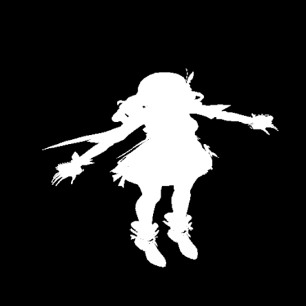
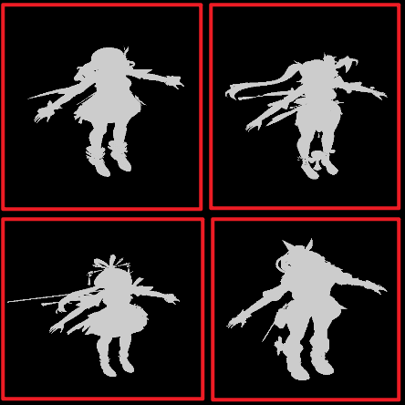

# 实现 Main Light Per-Object Shadow


Per-Object Shadow 就是给物体单独生成一张 Shadow Map，解决物体在默认的 Cascaded Shadow Map 上占比较小，阴影精度低的问题。一般都给角色用，顺便还能把场景阴影和角色阴影分开。




代码大体上按照 URP 的 [`MainLightShadowCasterPass`](https://github.com/Unity-Technologies/Graphics/blob/master/Packages/com.unity.render-pipelines.universal/Runtime/Passes/MainLightShadowCasterPass.cs) 写即可。这篇文章主要记录一些有差异的地方。

参考文章：

- [图形引擎实战：自阴影渲染分享 - 知乎](https://zhuanlan.zhihu.com/p/667305414)
- [Unity 从DecalSystem创建PerObjectShadow - 知乎](https://zhuanlan.zhihu.com/p/666545782)

## 角色包围盒

要让角色尽可能撑满 Shadow Map，就需要知道角色的包围盒。两种方法：

1. 直接设置一个固定大小的 Box。
2. 找到角色身上所有投射阴影的 [`Renderer.bounds`](https://docs.unity3d.com/ScriptReference/Renderer-bounds.html)，将它们合并起来。

我选的是第二种。

### 筛选 Renderer

主要是检查 Material 用的 Shader 里有没有 Shadow Caster Pass。Editor 下需要额外考虑 [Scene visibility](https://docs.unity3d.com/Manual/SceneVisibility.html)。

``` csharp
private static bool TryAppendShadowRenderers(Renderer renderer, List<ShadowRendererData> outShadowRenderers)
{
#if UNITY_EDITOR
    if (UnityEditor.SceneVisibilityManager.instance.IsHidden(renderer.gameObject))
    {
        return false;
    }
#endif

    if (!renderer.enabled || renderer.shadowCastingMode == ShadowCastingMode.Off)
    {
        return false;
    }

    if (!renderer.gameObject.activeInHierarchy)
    {
        return false;
    }

    try
    {
        bool hasShadowCaster = false;
        renderer.GetSharedMaterials(s_CachedMaterialList);

        for (int i = 0; i < s_CachedMaterialList.Count; i++)
        {
            Material material = s_CachedMaterialList[i];

            if (TryGetShadowCasterPass(material, out int passIndex))
            {
                hasShadowCaster = true;
                outShadowRenderers.Add(new ShadowRendererData(renderer, material, i, passIndex));
            }
        }

        return hasShadowCaster;
    }
    finally
    {
        s_CachedMaterialList.Clear();
    }
}

private static bool TryGetShadowCasterPass(Material material, out int passIndex)
{
    Shader shader = material.shader;

    for (int i = 0; i < shader.passCount; i++)
    {
        if (shader.FindPassTagValue(i, s_LightModeTagName) == s_ShadowCasterTagId)
        {
            passIndex = i;
            return true;
        }
    }

    passIndex = -1;
    return false;
}
```

### 合并包围盒

第一个 `bounds` 需要特殊处理。

``` csharp
Bounds bounds = default;
bool firstBounds = true;

for (int i = 0; i < renderers.Count; i++)
{
    Renderer renderer = renderers[i];

    if (TryAppendShadowRenderers(renderer, shadowRendererList))
    {
        if (firstBounds)
        {
            bounds = renderer.bounds;
            firstBounds = false;
        }
        else
        {
            bounds.Encapsulate(renderer.bounds);
        }
    }
}
```

## 计算变换矩阵

这部分代码我是拿 Burst + JobSystem 写的。

### View Matrix

这个比较简单，主要是要转到光源方向。

``` hlsl
float3 aabbCenter = (aabbMin + aabbMax) * 0.5f;
float4x4 viewMatrix = mul(s_FlipZMatrix, float4x4.TRS(-aabbCenter, MainLightRotationInv, 1));
```

- `aabbMin` 和 `aabbMax` 是角色包围盒的 Min 和 Max。
- `MainLightRotationInv` 是主光源旋转的逆。
- View Space 是 -Z 朝前的右手坐标系。`s_FlipZMatrix` 即

    $$
    \begin{bmatrix}
    1 &0  &0  &0 \\
    0 &1  &0  &0 \\
    0 &0  &-1 &0 \\
    0 &0  &0  &1
    \end{bmatrix}
    $$

    用来翻转 Z 轴。

### 剔除不可见的阴影

先要把角色的 AABB 包围盒和视锥体变换到 View Space，需要刚才的 `viewMatrix`。

变换一个 AABB，只要把它的 8 个顶点变换一下，然后重新计算 Min 和 Max。Unity 提供了 [`GeometryUtility.CalculateBounds`](https://docs.unity3d.com/ScriptReference/GeometryUtility.CalculateBounds.html) 方法。不过我这里要用 Burst，所以就自己写了一个。

``` hlsl
private static void CalculateAABB(float4* points, int count, in float4x4 transform, out float3 aabbMin, out float3 aabbMax)
{
    aabbMin = float3(float.PositiveInfinity);
    aabbMax = float3(float.NegativeInfinity);

    for (int i = 0; i < count; i++)
    {
        float3 p = mul(transform, points[i]).xyz;
        aabbMin = min(aabbMin, p);
        aabbMax = max(aabbMax, p);
    }
}
```

视锥体是个棱台，比较麻烦。为了简化计算，就也把它的 8 个顶点用上面的方法变换一下，然后计算 AABB。视锥体的顶点可以用 [`Camera.CalculateFrustumCorners`](https://docs.unity3d.com/ScriptReference/Camera.CalculateFrustumCorners.html) 来计算。

``` csharp
private static unsafe void CalculateFrustumEightCorners(Camera camera, float4* outCorners)
{
    const Camera.MonoOrStereoscopicEye Eye = Camera.MonoOrStereoscopicEye.Mono;

    var viewport = new Rect(0, 0, 1, 1);
    Transform cameraTransform = camera.transform;

    camera.CalculateFrustumCorners(viewport, camera.nearClipPlane, Eye, s_FrustumCornerBuffer);

    for (int i = 0; i < 4; i++)
    {
        Vector3 xyz = cameraTransform.TransformPoint(s_FrustumCornerBuffer[i]);
        outCorners[i] = new float4(xyz, 1);
    }

    camera.CalculateFrustumCorners(viewport, camera.farClipPlane, Eye, s_FrustumCornerBuffer);

    for (int i = 0; i < 4; i++)
    {
        Vector3 xyz = cameraTransform.TransformPoint(s_FrustumCornerBuffer[i]);
        outCorners[i + 4] = new float4(xyz, 1);
    }
}
```

这 8 个顶点可以直接分配在栈上，并且在 Job 之前就算好。

``` hlsl
const int FrustumCornerCount = 8;
float4* frustumCorners = stackalloc float4[FrustumCornerCount];
CalculateFrustumEightCorners(camera, frustumCorners);
```

检查角色 AABB 和视锥体 AABB，如果没有相交的话，这个阴影肯定看不见。

``` hlsl hl_lines="18"
const int AABBPointCount = 8;
float4* aabbPoints = stackalloc float4[AABBPointCount]
{
    float4(aabbMin, 1),
    float4(aabbMax.x, aabbMin.y, aabbMin.z, 1),
    float4(aabbMin.x, aabbMax.y, aabbMin.z, 1),
    float4(aabbMin.x, aabbMin.y, aabbMax.z, 1),
    float4(aabbMax.x, aabbMax.y, aabbMin.z, 1),
    float4(aabbMax.x, aabbMin.y, aabbMax.z, 1),
    float4(aabbMin.x, aabbMax.y, aabbMax.z, 1),
    float4(aabbMax, 1),
};
CalculateAABB(aabbPoints, AABBPointCount, in viewMatrix, out float3 shadowMin, out float3 shadowMax);

CalculateAABB(FrustumCorners, FrustumCornerCount, in viewMatrix, out float3 frustumMin, out float3 frustumMax);

// 剔除一定不可见的阴影
if (any(shadowMax < frustumMin) || any(shadowMin.xy > frustumMax.xy))
{
    projectionMatrix = default;
    return false;
}
```

这是在主光源（平行光）的 View Space 里计算的，考虑到阴影可以打到无穷远处，`shadowMin.z` 在这里需要当成负无穷处理，所以在做相交检测时，`any(shadowMin.xy > frustumMax.xy)` 这一半不需要检查 `z`。

### Projection Matrix

主光源（平行光）用的是正交投影，光源视锥体要恰好包住角色，让角色撑满 Shadow Map。

``` hlsl
float left = shadowMin.x;
float right = shadowMax.x;
float bottom = shadowMin.y;
float top = shadowMax.y;
float zNear = -shadowMax.z;
float zFar = -min(shadowMin.z, frustumMin.z);
zFar = zNear + min(zFar - zNear, 5000); // 避免视锥体太长，深度的精度可能不够

projectionMatrix = float4x4.OrthoOffCenter(left, right, bottom, top, zNear, zFar);
```

计算 `zNear` 和 `zFar` 时需要注意几点：

- [`Matrix4x4.Ortho`](https://docs.unity3d.com/ScriptReference/Matrix4x4.Ortho.html) 和 [`float4x4.OrthoOffCenter`](https://docs.unity3d.com/Packages/com.unity.mathematics@1.2/api/Unity.Mathematics.float4x4.OrthoOffCenter.html#Unity_Mathematics_float4x4_OrthoOffCenter_System_Single_System_Single_System_Single_System_Single_System_Single_System_Single_) 用的公式是

    $$
    \text{zNear} \le -z \le \text{zFar}
    $$

    > The returned matrix embeds a z-flip operation whose purpose is to cancel the z-flip performed by the camera view matrix. If the view matrix is an identity or some custom matrix that doesn't perform a z-flip, consider multiplying the third column of the projection matrix (i.e. m02, m12, m22 and m32) by -1. [^1]

- `zFar` 理论上应该取无穷大，但实际上肯定不能这么干。把 `zFar` 拉到足够远处，使得 `zNear` 和 `zFar` 能包住相机视锥体中所有可能接收阴影的物体就好。即 `zFar = -min(shadowMin.z, frustumMin.z)`。
- Scene View 的相机开了 Dynamic Clipping 以后，相机的视锥体可能非常非常长，使得我们算出的 `zFar - zNear` 也特别大，深度的精度会不够用。最好是限制一下 `zFar - zNear` 的长度，太远的地方就不管了。

## 绘制阴影图集

一个场景里通常有多个角色。这里用老方法，把角色阴影都画到一张图集上，最多画 16 个，每一块分辨率用 512x512。

``` csharp
private const int MaxShadowCount = 16;
private const int TileResolution = 512;
private const int ShadowMapBufferBits = 16;
```

根据阴影数量分配 Shadow Map。我分配的始终是一张正方形的 Shadow Map。

``` csharp
m_ShadowMapSizeInTile = Mathf.CeilToInt(Mathf.Sqrt(m_ShadowCasterList.Count));
int shadowRTSize = m_ShadowMapSizeInTile * TileResolution;
ShadowUtils.ShadowRTReAllocateIfNeeded(ref m_ShadowMap, shadowRTSize, shadowRTSize, ShadowMapBufferBits);

ConfigureTarget(m_ShadowMap);
ConfigureClear(ClearFlag.All, Color.black);
```

绘制的时候，先算当前 tile 的位置。

``` csharp
for (int i = 0; i < m_ShadowCasterList.Count; i++)
{
    // ...
    Vector2Int tilePos = new(i % m_ShadowMapSizeInTile, i / m_ShadowMapSizeInTile);
    // ...
}
```

然后，设置 Viewport，用 ScissorRect 加一点 padding，最后再画。

``` csharp
private static void DrawShadow(CommandBuffer cmd, Vector2Int tilePos, in ShadowCasterData casterData)
{
    Rect viewport = new(tilePos * TileResolution, new Vector2(TileResolution, TileResolution));

    cmd.SetViewProjectionMatrices(casterData.ViewMatrix, casterData.ProjectionMatrix);
    cmd.SetViewport(viewport);
    cmd.EnableScissorRect(new Rect(viewport.x + 4, viewport.y + 4, viewport.width - 8, viewport.height - 8));

    for (int i = 0; i < casterData.ShadowRenderers.Count; i++)
    {
        ShadowRendererData data = casterData.ShadowRenderers[i];
        cmd.DrawRenderer(data.Renderer, data.Material, data.SubmeshIndex, data.ShaderPass);
    }

    cmd.DisableScissorRect();
}
```

Shadow Caster 的 Shader 直接拿 URP 的，改个 LightMode 就行。



## Shadow Matrix

Shadow Matrix 的作用是把 World Space Position 变换成 xyzw（正交投影）。xy 是 Shadow Map 的 uv。z 是在光源空间的深度，用来和 Shadow Map 上的值比较。

``` csharp
private Matrix4x4 GetShadowMatrix(Vector2Int tilePos, in ShadowCasterData casterData)
{
    Matrix4x4 proj = casterData.ProjectionMatrix;

    if (SystemInfo.usesReversedZBuffer)
    {
        proj.m20 = -proj.m20;
        proj.m21 = -proj.m21;
        proj.m22 = -proj.m22;
        proj.m23 = -proj.m23;
    }

    float oneOverTileCount = 1.0f / m_ShadowMapSizeInTile;

    Matrix4x4 textureScaleAndBias = Matrix4x4.identity;
    textureScaleAndBias.m00 = 0.5f * oneOverTileCount;
    textureScaleAndBias.m11 = 0.5f * oneOverTileCount;
    textureScaleAndBias.m22 = 0.5f;
    textureScaleAndBias.m03 = (0.5f + tilePos.x) * oneOverTileCount;
    textureScaleAndBias.m13 = (0.5f + tilePos.y) * oneOverTileCount;
    textureScaleAndBias.m23 = 0.5f;

    // Apply texture scale and offset to save a MAD in shader.
    return textureScaleAndBias * proj * casterData.ViewMatrix;
}
```

## Shadow Map Rect

Shadow Map Rect 是图集上某一块 tile 的 uv 范围。

``` csharp
private Vector4 GetShadowMapRect(Vector2Int tilePos)
{
    // x: xMin
    // y: xMax
    // z: yMin
    // w: yMax
    return new Vector4(tilePos.x, 1 + tilePos.x, tilePos.y, 1 + tilePos.y) / m_ShadowMapSizeInTile;
}
```

## 采样阴影

在 Shader 里直接遍历每个角色的阴影，如果 `shadowPos` 在对应的 uv 范围里就采样。`SampleShadowmap` 是 URP 内置的，直接用就行。

``` hlsl
for (int i = 0; i < _PerObjShadowCount; i++)
{
    // wpos 是 World Space Position
    float4 shadowPos = mul(_PerObjShadowMatrices[i], float4(wpos, 1));
    float4 rects = _PerObjShadowMapRects[i];

    if (shadowPos.x >= rects.x && shadowPos.x <= rects.y && shadowPos.y >= rects.z && shadowPos.y <= rects.w)
    {
        float shadow = SampleShadowmap(
            TEXTURE2D_SHADOW_ARGS(_PerObjShadowMap, sampler_PerObjShadowMap),
            shadowPos,
            shadowSamplingData,
            shadowParams,
            false);
        // ...
    }
}
```

## SRP Batcher

目前，我还没想到合适的方法来支持 SRP Batcher。

想支持 SRP Batcher 的话，要用 [`ScriptableRenderContext.DrawRenderers`](https://docs.unity3d.com/ScriptReference/Rendering.ScriptableRenderContext.DrawRenderers.html)，但它只能绘制相机里可见的物体。有些物体会投射阴影，但是它不在相机里。

[^1]: [Unity - Scripting API: Matrix4x4.Ortho](https://docs.unity3d.com/ScriptReference/Matrix4x4.Ortho.html)
